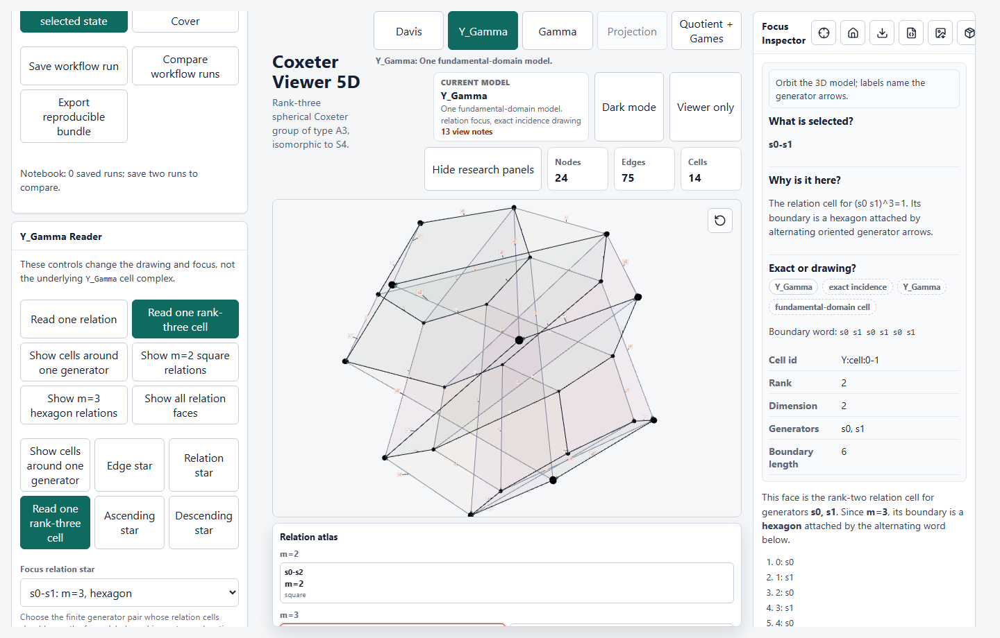

# Coxeter Viewer 5D

An offline-capable local web app for inspecting finite Coxeter Cayley balls,
Davis cells, hyperbolic chamber projections, the one-vertex base complex
`Y_Gamma`, the defining Coxeter graph `Gamma`, quotient diagnostics, and
state/cochain game experiments.

The app is an educational and research workflow tool, not a theorem prover. It
keeps exact data, numerical geometry, and drawing conventions visibly separate.

## License

Unless otherwise noted, CoxeterViewer5D source code, scripts, bundled JSON
examples, and documentation are released under the Apache License 2.0. Source
references cited in the data remain the property of their respective
authors/publishers; this project licenses only its own transcriptions, code,
and generated artifacts.

## What Is This App For?

CoxeterViewer5D is for looking at Coxeter-group topology before turning it into
formulas. It helps you inspect finite Cayley balls, Davis cells, the
fundamental-domain style complex `Y_Gamma`, the defining graph `Gamma`,
quotient/game experiments, and projected chamber barycenters in one offline
viewer.

The app is deliberately conservative about claims. It can show certified source
data, exact incidence records, numerical projections, and readability drawings,
but it keeps those categories visibly separate.

## What Can I Click First?

Start in **Teaching** mode. Use **Start Here** for one of five entry points:

- **Explore a Coxeter example**: open a local Davis view around one chamber.
- **Find a relation cell**: focus one finite relation polygon.
- **Understand Y_Gamma**: switch to the one-vertex fundamental-domain model.
- **Study a quotient/game**: open the JNW cube graph legal-system demo, with
  the I2(5) quotient/cocycle demo nearby in Research Workflow.
- **Inspect exactness and data status**: move to Research mode for examples,
  caveats, and backend status.

The top model switch always means the same thing:

- **Davis complex**: Cayley graph plus Davis cells.
- **Y_Gamma**: one fundamental-domain model.
- **Defining graph Gamma**: defining graph of the Coxeter system.
- **Projection drawing**: chamber barycenters drawn in 3D.
- **Quotient + Games**: imported/generated quotient complex and game
  diagnostics.

## What Is Exact?

Bundled compact 5-cube, Makarov `P0` 5-prism, Emery-Kellerhals `P1 = D P0`
double, and Makarov `P2 = [5,3,3,3,4]` data are certified for source
transcription, algebraic dotted values, and exact Gram/signature diagnostics.
`P1` is still described as a double of the prism, not as a simplicial prism.
Generated Sage and GAP fixtures carry backend metadata and certification
summaries. Finite quotient exports can be produced by native Sage or GAP
subgroup/coset exporters when those tools are available; otherwise the scripts
fall back to clearly labeled in-repo finite checks.

The **Focus Inspector** reports whether the selected object is certified,
exact incidence, a visual proxy, a projection, or uncertified.

## What Is Only A Drawing?

Shell layouts, chamber-centered local layouts, `Y_Gamma` readability
embeddings, higher Davis proxy hulls, label leader lanes, **Show only...**
filters, side-by-side drawing comparison, and PCA projections are drawings. They are
designed to make incidence and local topology legible; they are not claims of
exact Euclidean or hyperbolic embedding.

Axis-based Klein/Poincare views draw a scaled reference ball. PCA views hide the
ball because PCA coordinates are not ball-model coordinates.

For the project-wide vocabulary, see
[docs/exact-vs-drawing.md](docs/exact-vs-drawing.md) and
[docs/glossary.md](docs/glossary.md).

## How Do I Run Web/Desktop?

Use the web app when you want the quickest local run from source. Use the
desktop app when you want native windows, local session files, menus, and
packaged release artifacts.

## Run The App From Source

These commands are for someone who has just cloned or downloaded the repository
from GitHub. They require Node.js with Corepack enabled; the repository pins
`pnpm@11.3.0` in `package.json`.

```bash
corepack enable
corepack pnpm install
corepack pnpm dev
```

If you already have a compatible `pnpm` installed globally, `pnpm dev` is fine.
The `corepack pnpm ...` form is the safest one for a fresh checkout.

Vite prints a local URL, usually `http://127.0.0.1:5173/`. Open that URL in a
browser. The viewer is offline after dependencies are installed; bundled
examples and ordinary JSON imports do not need Sage, GAP, KBMAG, or CoxIter.

For a production-style web build:

```bash
corepack pnpm build
corepack pnpm preview
```

`build` writes static files to `dist/`. The `preview` command serves that build
locally so you can check what a web release will look like.

## Run The Desktop App From Source

The desktop app is a Tauri v2 wrapper around the same web viewer. It is useful
for native windows, local session files, desktop menus, and packaging tests; it
does not change the mathematical model.

Desktop development needs the web dependencies above plus Rust and the normal
Tauri platform prerequisites for your operating system. On Windows, WebView2 is
also required; most current Windows installations already include it.

```bash
corepack pnpm desktop:dev
```

That starts the Vite dev server and opens the Tauri window.

To make an unsigned local desktop bundle:

```bash
corepack pnpm desktop:build
```

Tauri writes platform-specific output under `src-tauri/target/release/`; bundled
installers and app packages live under `src-tauri/target/release/bundle/`.

## One-Click Desktop Download

Yes. The research-preview releases include desktop artifacts on GitHub:

- [CoxeterViewer5D v0.2.0 research preview](https://github.com/hgfjh/CoxeterViewer5D/releases/tag/v0.2.0)
- Windows x64: installer-style `.exe` and MSI `.msi` artifacts when the release
  workflow completes.
- macOS: `.dmg` and `.app.tar.gz` artifacts for Apple Silicon and Intel Macs
  when the release workflow completes.
- Linux x64: `.AppImage`, `.deb`, and `.rpm` artifacts when the release
  workflow completes.
- `CoxeterViewer5D-v0.2.0-web.zip`: static web build for people who want to
  host or inspect the built app.
- A sample `.coxeter-session.json` file for trying the saved-session workflow.

The older [v0.1.0 public alpha](https://github.com/hgfjh/CoxeterViewer5D/releases/tag/v0.1.0)
remains available as a historical snapshot. The rest of this README describes
the current source tree and current research-preview behavior.

The desktop artifacts are unsigned, and macOS artifacts are not notarized yet.
Windows and macOS may show a warning the first time you launch them; that is
expected for this research preview. The app does not need network access after
installation, and the bundled examples work without Sage, GAP, KBMAG, or
CoxIter. Those external tools are only needed for regenerating or independently
checking some research artifacts.

## How To Read The Viewer

The app is organized around a simple routine:

1. Choose an example.
2. Choose a model: **Davis complex**, **Y_Gamma**, **Defining graph Gamma**,
   **Projection drawing**, or **Quotient + Games**.
3. Choose a focus, then read the **Focus Inspector**.

The inspector is the safest place to start. It always answers three questions:

- **What is selected?**
- **Why is it here?**
- **Exact or drawing?**

For the JNW workflow, keep the layers separate:
**Davis complex Sigma -> JNW commutator cover X_ab -> four-state move-kernel
cover X_mu -> Y_Gamma**. The app's compact reader shows `X_mu`, a four-sheeted
cover of the base fundamental-domain model `Y_Gamma`; it does not relabel the
256-vertex commutator cover from JNW21 as a four-state complex. Ascending and
descending links are computed at a selected cover vertex from the state subset.

Use **Start Here** in Teaching mode for one-click tours. Use **Research** mode
when you want imports, backend status, certificates, notebooks, detailed cell
budgets, quotient builders, and raw topology panels. See
[docs/walkthroughs.md](docs/walkthroughs.md) for scripts that explain what to
inspect and what each view does not claim.

## Guided Demo Path

For a first research-preview pass, use these five demos in order:

1. **Find a hexagon**: load `A2`, start **Find a hexagon**, and inspect the
   filled `m = 3` rank-two Davis cell.
2. **Inspect A3 rank-three cell**: load `A3`, open the rank-three
   `Y_Gamma(A3)` focus, and show the square/hexagon incidence as a 3D object.
3. **Inspect `Y_Gamma` for P2**: load **Compact 5-prism P2 Makarov**, open the
   3D `Y_Gamma` model, and use one-relation or around-generator focus before
   showing the full two-skeleton.
4. **Run `I2(5)` quotient/game**: open the Research Workflow demo, inspect the
   **Generator-Uniform Cochain** with `s0 = +1, s1 = -1`, and show the zero
   boundary-sum diagnostic on the decagon.
5. **Play the JNW cube game**: use **Start Here** -> **Study a quotient/game**
   or **Load JNW cube game** in Research Workflow. The defining graph is the
   1-skeleton of a 3-cube, and the preset uses the bipartition move system from
   Jankiewicz-Norin-Wise.

Presenter scripts live in [docs/walkthroughs.md](docs/walkthroughs.md). Capture
and caption guidance lives in [docs/demo-media.md](docs/demo-media.md).
The checked-in stills live in [docs/screenshots](docs/screenshots) and can be
regenerated with `corepack pnpm demo:screenshots`.

| Demo                          | Reference Capture                                                                                                                                                |
| ----------------------------- | ---------------------------------------------------------------------------------------------------------------------------------------------------------------- |
| Find a hexagon                |         |
| Inspect an A3 rank-three cell |       |
| Inspect `Y_Gamma` for P2      |   |
| Run `I2(5)` quotient/game     |  |
| Play the JNW cube game        | Use **Study a quotient/game** to open the 3-cube defining graph, the four-state move-kernel cover of `Y_Gamma`, and exact state-link diagnostics.                |

## Certification Status

Bundled compact 5-cube, Makarov `P0` 5-prism, Emery-Kellerhals `P1 = D P0`
double, and Makarov `P2 = [5,3,3,3,4]` data are certified for source
transcription, algebraic dotted values, and exact Gram/signature diagnostics.
`P1` is still described as a double of the prism, not as a simplicial prism.
Generated Sage and GAP fixtures carry backend metadata and certification
summaries. Finite quotient exports can now be produced by native
Sage or GAP subgroup/coset exporters when those tools are available; otherwise
the scripts fall back to a clearly labeled in-repo finite checker. Quotient
imports are validated for generator actions, involutions, relation closure, and
rank-two cells when the relevant data is supplied.

The example gallery also includes a searchable catalogue of all 16 compact 5D
eight-facet cases in Tumarkin's Table 4.10: 15 in the `G11411` family and the
unique `G12221` case. The diagrams are transcribed from the arXiv EPS source,
generated as loadable bundled examples, and certified for source transcription,
exact algebraic dotted weights, and normal-Gram rank/signature diagnostics. They
live in the catalogue instead of the main gallery so the first screen stays
readable.

## How Do I Study `Y_Gamma`?

Click **Y_Gamma** in the top view switch, or use the guided
`Y_Gamma 2-skeleton` mode. The viewer shows one base vertex, oriented generator
arrows, and rank-two relation faces. The `Y_Gamma Reader` offers narrated
presets to read one relation, read one rank-three cell, show square or hexagon
families, show cells around one generator, and show all relation faces. The 2D nerve/local-link
schematic is available as a separate topology view; it explains spherical
subsets but is not `Y_Gamma` itself.

Dense examples are meant to be read with focus tools, not by staring at every
cell at once. Use **Show only...** for generator families, relation orders, ranks,
edge stars, or relation stars; use **Extract relation star** to isolate one
relation with its incident higher cells; use **Separate cells for reading** and
**Compare shared vs separated drawing** to switch between the coherent
shared-spine picture and a more expanded readability drawing. Edge labels name
generators, and short leader ticks point labels back to their semantic edges.

Use the top view switch to move among **Davis complex**, **Y_Gamma**, and
**Gamma**. Gamma is the defining Coxeter graph. This viewer deliberately draws
finite rank-two relation edges, including `m = 2` commuting pairs that standard
Coxeter diagrams usually omit. Pairs with `m = inf` are absent because they do
not give finite rank-two relation cells, and every drawn edge is labeled by its
Coxeter matrix entry. The Gamma inspector also lists the connected components
of each monochromatic subgraph `Gamma_m`, including isolated singleton
generators, so relation-order partitions can be read without tracing the whole
diagram by eye.

## How Do I Run A Quotient/Game Experiment?

Use the **Research Workflow** panel. It is a five-step path:

1. **Source System**: start from a Coxeter system. The quotient/cocycle demo
   uses `I2(5)`. The JNW legal-system demo uses the right-angled Coxeter group
   whose defining graph is the 1-skeleton of a 3-cube.
2. **Subgroup/Cosets**: record subgroup generator words. The demo uses the
   identity subgroup, so all ten cosets of `I2(5)` are visible.
3. **Quotient Complex**: load or import the quotient artifact with Schreier
   action, permutation data, and rank-two quotient cells.
4. **Cocycle/Game**: choose either a **Generator-Uniform Cochain** or a
   **JNW Legal-System Game**. The I2(5) demo uses the cochain
   `s0 = +1, s1 = -1`, so the decagon boundary sum is zero while ascending and
   descending edges are both visible. The JNW cube demo preloads the JNW21 cube
   bipartition/color-class move system and the paper's displayed initial state
   `{v000, v010, v110, v111}`, so the diagnostics open on a right-angled legal
   orbit. The paper's commutator cover `X_ab` has 256 vertices for this
   eight-generator group. The compact reader instead shows the explicit
   move-kernel factor `X_mu`, whose four vertices are named `S_1`, ..., `S_4`.
   The **Choose state** control changes the active `S_i`; **Show four-state
   cover** opens the cover reader. A generator rail labeled `g` runs from `S_i`
   to `S_i xor m_g`. The cube demo has four state vertices, sixteen geometric
   generator rails, and twelve square relation cells. In serialized quotient
   data each rail has two inverse-paired directed records; the reader draws the
   underlying geometric rail once. **Exact cover 1-skeleton** shows only the
   state vertices and rails. **Four-chart cover drawing** subdivides each rail
   once and each square into four colored sectors so the four lifts of
   `Y_Gamma` can be followed through their shared gluing data. Use **Outlines
   only** or **Glass faces** when the 1-skeleton should dominate.
   **Choose relation** selects one alternating rank-two boundary, **Next
   relation** advances through the list, and **Focus selected relation** ghosts
   unrelated quotient edges; these controls do not add a separate central
   relation face. **Mirror selected state on Gamma** highlights the same subset
   directly on the defining graph. For non-right-angled systems, the same
   state/move panel is labeled as an experimental non-JNW generalization.
5. **Local Topology + Export**: inspect topology lenses and export a
   reproducible experiment bundle.

The topology lenses make quotient/game mode primary: generator star,
rank-three spherical cell, cells incident to an edge, **Ascending link at
selected state**, **Descending link at selected state**, and full local link.
For the JNW cube state `S`, these are the induced flag subcomplexes `L[S]` and
`L[V - S]`, where `L = Flag(Gamma)`. The faithful diagonal map has no level
directions; level links belong to the separate generalized cochain workflow.
`Y_Gamma` remains the fundamental-domain source object. The workflow readout reports
the visible vertices, edges, cells, local-link F2 homology, and flag-link status
so the topology is visible before opening the full inspector. Importing
quotient JSON still works, and the old raw builder remains available under
advanced controls, but the intended research path now lives in the workflow
panel.

The game panel deliberately separates two models. **Generator-Uniform
Cochain** is a simple integer 1-cochain editor: one integer per generator,
propagated to every edge with that label. **JNW Legal-System Game** follows the
Jankiewicz-Norin-Wise state/move convention: a state is a subset of defining
graph vertices, each move acts by symmetric difference, and an edge direction
depends on the current state. Only right-angled systems with passing move and
legal-orbit checks are labeled JNW faithful; non-right-angled examples remain
exploratory diagnostics.

The bundled **JNW cube graph** example is the clean playground for this second
model. Its generators are the eight binary vertices of a 3-cube, commuting
pairs are exactly cube edges, and the **Bipartite/color moves** preset is the
JNW legal system described in the paper.

The **Notebook/export** lane saves named runs with notes, warnings, scene stats,
selected objects, topology diagnostics, data hashes, and optional screenshots.
Bundles can be exported, imported, duplicated, and compared.

## Validation Commands

Use these from the repository root before publishing changes:

```bash
corepack pnpm format
corepack pnpm lint
corepack pnpm test
corepack pnpm build
corepack pnpm exec playwright test
corepack pnpm validate:research-grade
```

Useful research scripts:

```bash
corepack pnpm exact:sage:i2-5
corepack pnpm exact:gap:i2-5
corepack pnpm compare:backends
corepack pnpm certify:geometry:intervals:compact-5-cube
corepack pnpm certify:geometry:intervals:compact-5-prism
corepack pnpm quotient:sage:export
corepack pnpm quotient:gap:export
corepack pnpm quotient:sage:export:i2-5-demo
corepack pnpm quotient:gap:export:i2-5-demo
corepack pnpm quotient:sage:export:a3-demo
corepack pnpm quotient:gap:export:a3-demo
corepack pnpm compare:quotient-backends
corepack pnpm workflow:validate
corepack pnpm registry:validate
corepack pnpm session:validate
corepack pnpm bench:timed:machine
corepack pnpm demo:record
corepack pnpm release:web
corepack pnpm release:desktop
corepack pnpm certify:quotient:torsion-free
corepack pnpm notebook:validate path/to/bundle.json
```

External Sage, GAP/KBMAG, and CoxIter integrations are command-line tooling, not
browser dependencies. If a tool is unavailable, scripts should emit a clear
skipped or blocked status rather than making a weaker claim.

## Native Desktop Status

The optional Tauri shell wraps the same viewer and validation pipeline as the
web app. It adds narrow `.coxeter-session.json` file access, not a separate math
runtime. WASD camera nudging, orbit controls, focus/reset actions, labels,
rank-two cell toggles, and mode switches should behave the same in browser and
desktop builds. On desktop-size windows the viewer stays fixed while the side
rails scroll; light/dark mode and viewer-only mode are available from the top
strip for presentation and focused inspection.

`corepack pnpm release:desktop` reports bundle readiness, code-signing status, and
updater-signing status as deterministic JSON. Missing signing or updater
environment variables are reported as `skipped` and do not fail unsigned local
builds. Public auto-updating desktop releases still require maintainer-owned
platform signing credentials, a Tauri updater signing key, and an update
endpoint.

For heavy reproducibility runs, use `.researchcontainer/`. The normal
`.devcontainer/` stays light for app work; the research container adds
SageMath, GAP/KBMAG, and a stable CoxIter executable path for artifact checks.

## Documentation Map

- [docs/math.md](docs/math.md): Coxeter, Davis, quotient, game, and projection conventions.
- [docs/data-format.md](docs/data-format.md): JSON schemas and import/export behavior.
- [docs/viewer-design.md](docs/viewer-design.md): rendering, interaction, performance, and UI decisions.
- [docs/performance-audit.md](docs/performance-audit.md): measured bottlenecks, completed optimizations, and thresholds for future renderer work.
- [docs/ui-controls.md](docs/ui-controls.md): plain-language map of the main controls and what they change.
- [docs/tooling.md](docs/tooling.md): exact exporter contracts, scripts, runtime checks, and CI policy.
- [docs/desktop-ux.md](docs/desktop-ux.md): native wrapper UX, workspace layout, diagnostics, signing, and updater status.
- [docs/walkthroughs.md](docs/walkthroughs.md): guided readings for hexagon, rank-three, Gamma, `Y_Gamma`, and quotient/game views.
- [docs/jnw-state-quotient.md](docs/jnw-state-quotient.md): the commutator cover, the four-state move-kernel cover, and how both sit over `Y_Gamma`.
- [docs/ui-map.md](docs/ui-map.md): one annotated map of the main UI regions.
- [docs/known-limits.md](docs/known-limits.md): density, projection, non-planarity, and external-tool caveats.
- [docs/exact-vs-drawing.md](docs/exact-vs-drawing.md): how to separate exact incidence, numerical geometry, and readable drawings.
- [docs/glossary.md](docs/glossary.md): project vocabulary for Coxeter, Davis, geometry, quotient, and game terms.
- [docs/demo-media.md](docs/demo-media.md): screenshot, caption, sidecar, and demo-media guidance.
- [docs/releases/](docs/releases/): release-note templates and packaging status notes.
- [docs/references.md](docs/references.md): citations and what each source supports.
