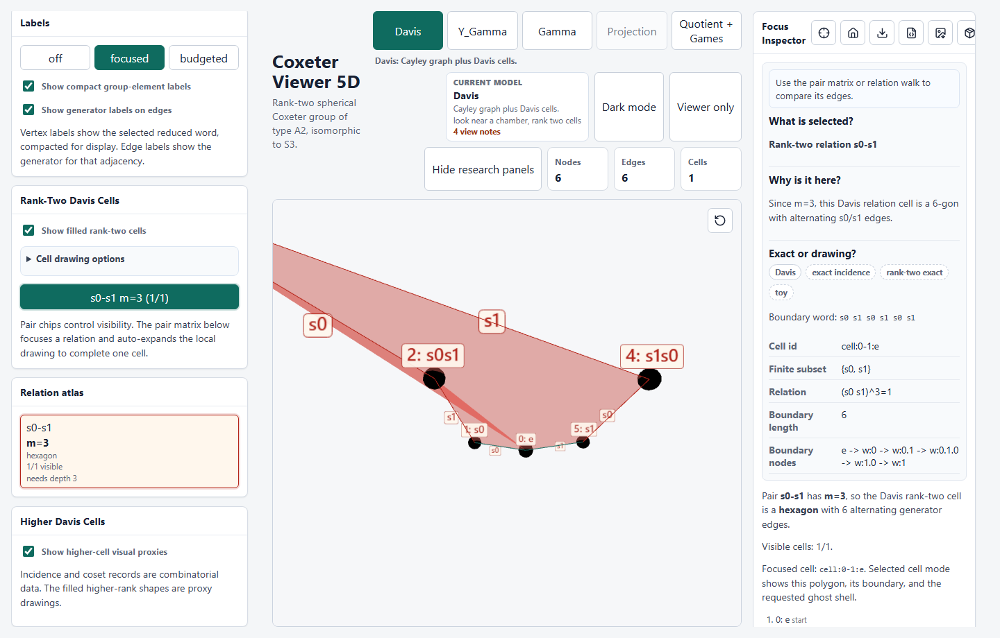
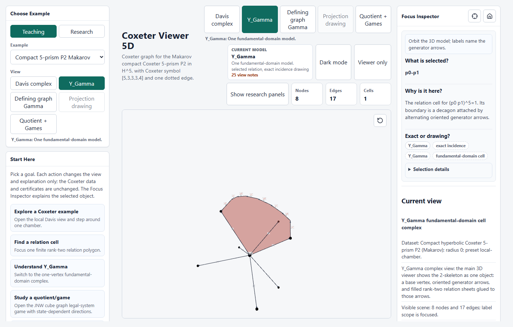
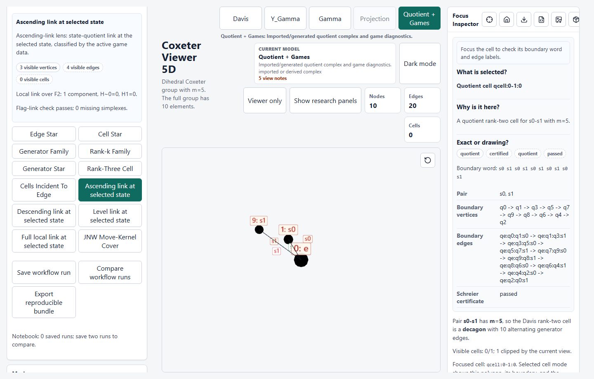

# Glossary

This glossary favors the meanings used inside CoxeterViewer5D. Some terms have
broader meanings in the literature.

## Visual Quick Reference

The screenshots below are orientation aids, not certificates. Use them to match
words in the UI to the kind of object being shown.

| Term             | What to look for                                                                                                                                                                       |
| ---------------- | -------------------------------------------------------------------------------------------------------------------------------------------------------------------------------------- |
| Cayley graph     | Generator-labeled edges between group elements; in a Davis view this is the 1-skeleton around the selected chamber.                                                                    |
| Davis cell       | A filled rank-two polygon such as the `A2` hexagon:                                                                     |
| `Y_Gamma`        | One base vertex with oriented generator arrows and relation sheets, as in the P2 relation view:                         |
| Gamma            | The defining Coxeter graph: generator vertices and finite rank-two relation edges labeled by `m`, including `m = 2`; `m = inf` pairs are omitted.                                      |
| Quotient complex | A finite quotient-style scene with vertices, generator actions, and relation cells, as in the I2(5) demo:  |
| Cocycle/cochain  | Integer edge data whose boundary sums can be checked around rank-two cells.                                                                                                            |
| JNW legal system | A state/move workflow where edge direction depends on a state subset, not one global generator sign. The guiding bundled example is the 3-cube defining graph.                         |
| Projection       | Chamber barycenters drawn in 3D from reflection data; the 3D picture is a projection unless explicitly certified.                                                                      |

## Barycenter

The point used to represent a chamber in geometric mode. In hyperbolic examples
this is usually a point on the hyperboloid, then projected to 3D for display.

## Cayley Ball

The finite-radius subgraph of the Cayley graph around the identity. A radius
`R` ball contains elements of word length at most `R`.

## Cayley Graph

The graph whose vertices are group elements and whose edges are right
multiplication by generators:

```text
w --i--> w * s_i
```

Edges may be drawn undirected because Coxeter generators are involutions, but
the generator label remains part of the data.

## Coxeter Matrix

The symmetric matrix `M = (m_ij)` defining the relations
`(s_i s_j)^m_ij = 1`. The diagonal entries are `1`; off-diagonal entries are
integers at least `2` or `"inf"`.

## Davis Cell

A cell in the Davis complex coming from a spherical special subgroup. The first
implemented cells are rank-two polygons with `2m` sides.

## Davis Complex

The cell complex built from the Cayley graph by attaching cells for spherical
special subgroups. The Cayley graph is its 1-skeleton.

## Drawing Convention

A visual placement chosen for readability, such as shell layout, force layout,
PCA projection, ghost context, or a proxy hull. A drawing convention can show
incidence clearly without preserving metric geometry.

## Exact Backend

An external generator, such as Sage or GAP/KBMAG, that emits a generated graph
artifact with exact or symbolic group-element handling within its stated scope.
The viewer still validates the artifact before rendering it.

## Generator

One element of the Coxeter generating set `S`. The app labels them by stable
ids such as `s0`, `s1`, and uses generator colors for edges and cells.

## Generator-Uniform Cochain

An exploratory integer 1-cochain that assigns one value to each generator and
uses that value on every edge with the corresponding generator label. It is
useful for quick boundary-sum checks, but it is not the same thing as the
Jankiewicz-Norin-Wise state/move game.

## Defining Graph `Gamma`

The Coxeter presentation graph. Its vertices are the generators, and its drawn
edges are the finite off-diagonal Coxeter matrix entries labelled by `m`. This
viewer includes commuting `m = 2` pairs, but omits `m = inf` pairs because they
do not represent finite rank-two relations.

## Geometric Projection

A 3D view produced from hyperbolic reflection data. The underlying chamber
points may live in dimension greater than three, so the displayed scene is a
projection.

## Gram Matrix

A matrix of inner products. Coxeter Gram entries for finite pairs use
`-cos(pi / m)`. Hyperbolic normal Gram data may also include dotted or numeric
entries.

## Hyperboloid Model

The model of hyperbolic space

```text
H^d = { x : -x0^2 + x1^2 + ... + xd^2 = -1, x0 > 0 }.
```

Facet normals are spacelike, and reflections are computed with the Lorentzian
inner product.

## Klein Projection

The map from the hyperboloid to a ball model

```text
spatial(x) / x0
```

It draws hyperbolic geodesics as straight chords, but it does not preserve
lengths or angles.

## Local Link

At a chamber vertex in the Davis complex, the simplicial complex whose vertices
are generators and whose simplices are spherical subsets. In quotients, the
local link may depend on the selected quotient vertex.

## Normal Coordinates

Explicit coordinates for reflection hyperplane normals in the chosen
Lorentzian vector space. These are preferred over numerical factorization from
a normal Gram matrix.

## PCA Projection

A deterministic linear projection fitted to a point cloud to choose three
drawing axes. PCA coordinates are not ball-model coordinates, so the reference
ball is hidden in PCA views.

## Poincare Projection

The map from the hyperboloid to the Poincare ball

```text
spatial(x) / (x0 + 1)
```

The full-dimensional map is conformal, but a later 3D axis choice or PCA step
can still distort what the viewer shows.

## JNW Legal-System Game

The state/move game model from Jankiewicz-Norin-Wise. A state is a subset of
defining-graph vertices; a move `m_i` acts by symmetric difference; and the
direction of an `s_i` edge depends on whether `i` lies in the current state.
The viewer labels this workflow JNW faithful only for right-angled Coxeter
systems with passing move and legal-orbit diagnostics. Non-right-angled uses
are explicitly experimental.

The easiest example is **JNW cube graph RACG**. Its defining graph is the
1-skeleton of a 3-cube, and the bipartition/color-class moves give the legal
system used by the app's guided JNW workflow.

The viewer's compact cube reader uses a derived four-state move-kernel cover.
Its vertices have short labels such as `S_1` and `S_2`; the inspector expands
the selected state as a subset of defining-graph vertices, for example
`S_1 = {v000, v010, v110, v111}`. At a state `S`, the ascending and
descending links are the induced subcomplexes `Flag(Gamma)[S]` and
`Flag(Gamma)[V - S]`. They are not ambient subgraphs of a Cayley-ball drawing.

## JNW Commutator Cover

The finite cover `X_ab = W' \ Sigma_Gamma` used in JNW21, where `W'` is the
kernel of the standard abelianization `W -> (Z/2)^V`. For the eight-generator
cube example it has 256 vertices. The four legal states are orientation
patterns on this cover, not its complete vertex set.

## JNW Move-Kernel Cover

The smaller cover drawn by the app's compact reader:
`X_mu = ker(mu o alpha) \ Sigma_Gamma`, where `mu(e_v) = m_v`. For the cube
move system its deck group has four elements, so the reader has four state
vertices, sixteen geometric generator rails, and twelve relation squares. The
covering hierarchy is `Sigma_Gamma -> X_ab -> X_mu -> Y_Gamma`.

## Quotient Complex

A finite complex obtained from quotient or coset data. It can carry generator
actions, edges, cells, and certificates. It should not be called a manifold
without torsion-free verification.

## Rank-Two Davis Cell

For a finite Coxeter pair `(i, j)` with `m_ij = m`, the polygon with `2m`
boundary edges attached for one coset of `<s_i, s_j>`.

## Rank-Three Cell

A higher Davis cell associated to a spherical subset of three generators. The
viewer may show a bounded 3D incidence proxy unless exact cell coordinates are
provided.

## Reduced Word

A shortest expression for a group element in the Coxeter generators. The app
stores one preferred reduced word for inspection; it need not be unique.

## Spherical Subset

A subset of generators whose special subgroup is finite. The app detects this
from finite Coxeter entries and positive definiteness of the finite Coxeter
Gram matrix.

## Torsion-Free Certificate

Evidence that a quotient has no finite-order stabilizers in the relevant
scope. The in-repo visible stabilizer guard is bounded; manifold language
requires an external or published certificate with a clear scope.

## Warning

A first-class part of the data and UI. Warnings record approximations,
truncation, missing geometry, placeholder status, and other caveats that affect
how the scene should be read.

## `Y_Gamma`

The one-vertex base complex derived from a Coxeter system: one base vertex,
oriented generator arrows, and relation faces for finite Coxeter pairs. It is
not the Cayley graph and not automatically a manifold quotient.
