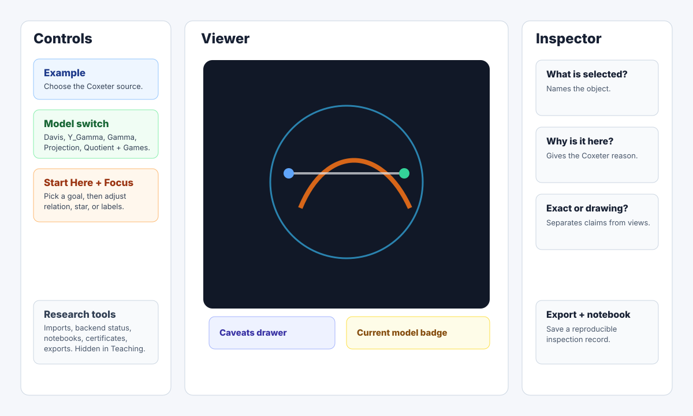

# UI Map

This page is the quick orientation map for CoxeterViewer5D. It is intentionally
short: the main viewer should feel like the center of the app, and every panel
around it should answer one job.

For a button-by-button explanation, see [UI Controls](ui-controls.md).

## Main Regions

- **Choose Example** chooses the source Coxeter system, generated graph, or
  quotient artifact. In Research mode the same area is **Choose / Load**.
- **Model switch** changes the mathematical object: Davis, `Y_Gamma`, Gamma,
  Projection, or Quotient + Games.
- **Start Here + Focus controls** choose a goal and keep the first-time
  Teaching mode quiet.
- **Viewer** is the primary object. Panels should support the scene, not push
  it off screen.
- **Current model badge** states which model is active and whether the selected
  object is exact, certified, approximate, projection-only, or experimental.
- **Caveats drawer** keeps warnings visible without turning the UI into a wall
  of text.
- **Inspector** always answers three questions: what is selected, why it is
  here, and whether it is exact data or a drawing convention.
- **Research tools** contain import/export, backend, certificate, notebook, and
  catalogue controls. They are hidden in Teaching mode.
- **Export + notebook** records a reproducible inspection when a view becomes
  research evidence.

## Reading The App

If a control changes the mathematics, it belongs in data, import, quotient, or
certificate workflows. If a control changes visibility, spacing, camera, labels,
or **Show only...** filters, it is a drawing control. The UI uses that split
throughout the app.
